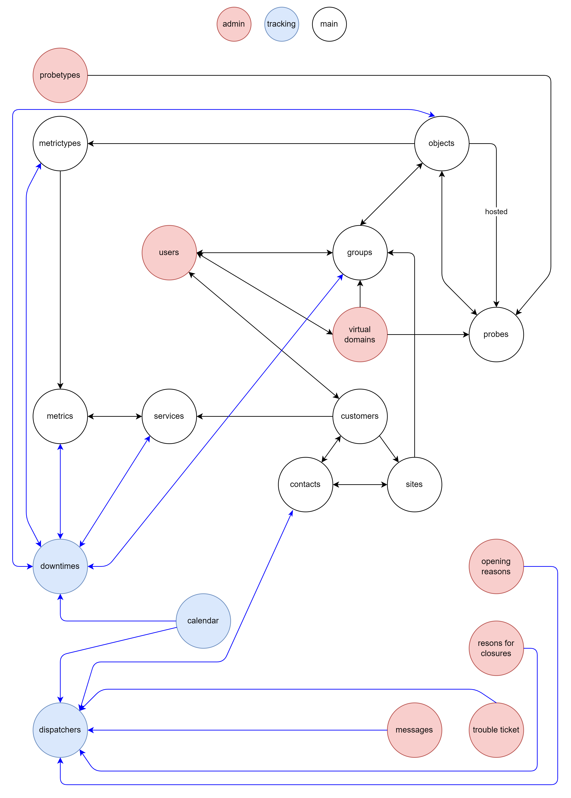

# Generic documentation of the XA system

The structure of XAUTOMATA is complex and combines elements of a tree hierarchy with lists from a graph, but if we focus on the interaction with the elements of a client's asset, the complexity is somewhat reduced.

We can envision having a client's asset and a series of services that point to that asset, enriching the information present or adding functionality.

## The Asset

As an **asset**, we define everything that constitutes the client's physical perimeter. The asset is hierarchically defined by the following components (in descending hierarchical order):
- Customer
- Site
- Group
- Object
- Metric_type
- Metric
- Service

Each of these levels contains information; the customer defines the client, the sites define the client's branches, etc. Each level is connected with a one-to-many relationship to the level below, meaning a site has groups within it, but a group cannot exist in multiple sites. 

There is an exception for groups; for the most part, they maintain a one-to-many relationship with metric types, but an object can belong to multiple groups. Thus, we can say that there is a many-to-many relationship between groups and objects.

Each element can be identified by a series of primary keys that also include the UUID of its upper level. This, of course, is not true for objects due to the many-to-many nature with groups.

The services that close the hierarchy represent a second exception: they have a hierarchical importance similar to metrics, can be linked to metrics in a many-to-many relationship, but may also exist completely independent of the asset. Services provide additional information derived from customer values or other data and are not necessarily tied to the asset. If they are linked to the asset, it is through the metrics, in which case there is a reference to all the metrics that contributed to forming the service.

The structure from the customer to the service represents the asset and is referred to as the **tree**.

To navigate the tree, there are APIs that allow you to obtain the linking information of one layer with the others. For example, if I know a **metric** and want to find out which **object** it belongs to, the **metric** data itself contains the *uuid* of the **metric_type** that encompasses it. With that *uuid*, I can retrieve the details of the **metric_type**, which includes the *uuid* of the **object** it contains. With that *uuid*, I can then request the details of the **object** I was interested in.

The same is true in the opposite direction; if I identify an **object**, I can find out all the **metric_types** that comprise it, and by selecting one, I can request all the **metrics** that belong to it.

This method of navigating the tree has some variations when trying to traverse layers with many-to-many relationships. To find out which **groups** contain an **object** and vice versa, there are specific APIs that, given one of the two layers, will return the other. This also applies to **services**, which have the same many-to-many nature.

There are shortcuts for navigating the tree, and these shortcuts take the form of the **tree_hierarchy** API set. This API is designed to retrieve an element in the tree along with all its links to the upper layers.

## Time Series

The asset represents the objects that produce data, but the data itself is collected in a different location, specifically in time series tables. 

These series are divided into two types: **state** series and **value** series.

State series are a succession of information collected in dictionaries; they can contain any type of information and carry a *gravity* index. Value series are sequences of numbers, ideal for collecting numerical data such as temperature, speed, etc.

**Metrics** are the layer where these series are stored. Each **metric** is directly linked to one and only one time series, whether it is a state series or a value series.

**Services** can also be linked to time series, and unlike **metrics**, they can simultaneously point to both value series and state series.

## Additional Information

Relationships do not end with the asset; there is a myriad of additional information that can be explored, such as **users**, **dashboards**, and so on. The way to navigate these connections is the same as navigating the tree.

The complete connection between all elements accessible via API is presented in the diagram below.

[//]: # ()

